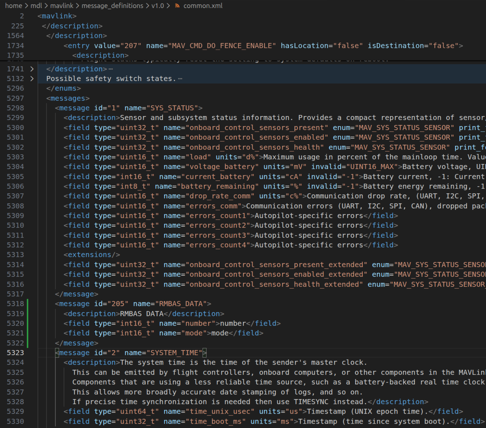
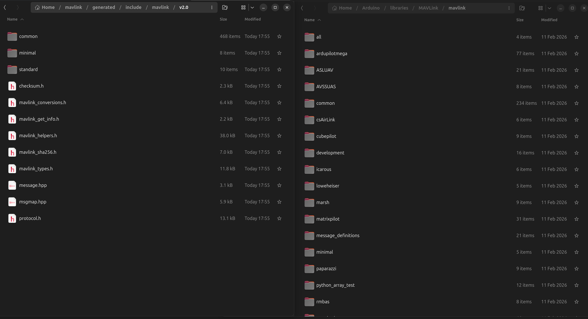

# Практическое задание №1

# Работа с MAVLink сообщениями

## Требуемое программное обеспечение

В данном разделе указывается программное обеспечение, необходимое для выполнения данной практической работы. Однако, представленное здесь программное обеспечение будет использоваться и для выполнения других практических работ, поэтому крайне рекомендуется:

* знать, откуда скачать;
* уметь установить;
* владеть интерфейсом, основными функциями и документацией.

> Главный источник информации для достижения данных рекомендаций - изучение документации и использование сети Интернет. 😄 👍
>
> Использование LLM крайне не привествуется и будет наказываться. 😕 👎

### Ubuntu 24.04

[Скачать](https://ubuntu.com/download/desktop)

[Гайд по установке](https://ubuntu.com/tutorials/install-ubuntu-desktop#1-overview)

[Туториал 1](https://ubuntu.com/tutorials/command-line-for-beginners#1-overview)

[Туториал 2](https://www.youtube.com/watch?v=D4WyNjt_hbQ)

### MAVLinkV2

[Исходный код](https://github.com/mavlink/mavlink)

[Гайд по установке](https://mavlink.io/en/getting_started/installation.html)

[Документация](https://mavlink.io/en/)

[Документация по кодгенератору](https://mavlink.io/en/getting_started/generate_libraries.html)

### Arduiuno IDE с поддержкой плат ESP8266

[Гайд по установке](https://support.arduino.cc/hc/en-us/articles/360019833020-Download-and-install-Arduino-IDE)

[Гайд по настройке для ESP8266](https://www.instructables.com/Setting-Up-the-Arduino-IDE-to-Program-ESP8266/)

[Библиотека MAVLinkV2 для ArduinoIDE](https://github.com/okalachev/mavlink-arduino)

[Краткое руководство по Arduino IDE](https://alexgyver.ru/arduino-first/)

[Уроки по Arduino IDE](https://alexgyver.ru/lessons/)

## Введение

Цель данной практической работы - изучить принципы работы протокола MAVLinkV2, научиться создавать кастомные сообщения, осущесвлять отправку и принятие сообщений MAVLinkV2.

Задачи данной практической работы:

* Написать определение кастомного сообщения MAVLink;
* Отправить и принять кастомное сообщение MAVLink;

Для выполнения задач и достижения цели в данной практической работе будет использоваться реальное аппаратное обеспечение, представляющнее собой микроконтроллер ESP8266.

Реализация отправки, приёма и обработки MAVLink сообщений на указанном микроконтроллере будет осуществляться с помощью языка программирования C++11 в среде разработки ArduinoIDE.

В качестве стенда для данной практической работы будет выступать:

1) Плата разработки MESP на основе микроконтроллера ESP8266
2) Плата разработки NodeMCU на основе микроконтроллера ESP8266

Подключение к компьютеру и прошивка платы NodeMCU осуществляется через провод micro-USB - USB.

Плата MESP отправляет MAVLink сообщение, подробное описаное в "Этапе 3", с частотой 1 Гц. Первая часть практической работы заключается в написании программы для микроконтроллера платы NodeMCU, принимающей и обрабатывающей MAVLink сообщения с платы MESP. При успешном выполнении первой части необходимо написать программу для отправки другого, указанного преподаватем, сообщения MAVLink.

## Выполнение практической работы

### Этап 1 - установка программного обеспечения

В связи с тем, что ваша дальнейшая образовательная деятельность будет направлена на выполнение тех или иных инженерных проектов, наличие стационарной операционной системы Ubuntu преобретает обязательный характер. Вам необходимо установить данную операционную систему на ваш компьютер в качестве второй (или основной). Если вы не имеете возможности для установки данной операционной системы на ваш компьютер, для выполнения практичесих работы вы можете использовать компьютеры, расположенные в Лаборатории.

В данном руководстве к практическому занятию процесс установки операционной системы Ubuntu описываться не будет. Ссылку на подоробный гайд по установке операционной системы вы можете найти в разделе "Требуемое программное обеспечение" данной практической работы. Аналогично, не будет описываться процесс установки Arduino IDE и пакета ESP8266. Гайды по установке данного ПО находятся в том же разделе.

В данном руководстве не будут описываться промежуточные или незначительные шаги по установке тех или иных библиотек или зависимостей. Предполагается, что студенты самостоятельно, с помощью информации из сети Интернет, смогут решить возникающие проблемы.

### Этап 2 - Скачивание репозитория MAVLink и установка зависимостей

Откройте терминал и выполните данные команды в терминале. Данная команда создает в домашеней  директории папку mavlink с содержимым репозитория MAVLink.

```
sudo apt install python3-pip
git clone https://github.com/mavlink/mavlink.git --recursive
```

Перейдите в созданную директорию.

```
cd mavlink/
```

Создайте виртульную среду python для установки всех необходимых пакетов python и запустите среду.

```
python3 -m venv .venv
source .venv/bin/activate
```

Установите требуемые пакеты python.

```
python3 -m pip install -r pymavlink/requirements.txt
```

### Этап 3 - Генерация библиотеки MAVLink2 для C++ с кастомным сообщением

Откройте в редакторе файл `mavlink/message_definitions/v1.0/common.xml`.

Начиная со строки 5297 начинаются определения для сообщений. Необходимо вставить туда наше кастомное сообщение. Важно, чтобы ID нашего сообщения не совпадал с другими, уже имеющимися сообщениями.

Пример сообщения:

```
<message id="205" name="RMBAS_DATA">
    <description>RMBAS DATA</description>
    <field type="int16_t" name="number">number</field>
    <field type="int16_t" name="mode">mode</field>
</message>
```

Вставленное между сообщениями с ID 1 и ID 2 наше сообщения в коде:



> Не забывайте сохранять измененные файлы

Компилируем из измененного .XML файла библиотеку с помощью команды, показанной ниже. Пояснения к полям команды можете найти в официальной документации MAVLink на странице кодгенератора.

```
python3 -m pymavlink.tools.mavgen --lang=C++11 --wire-protocol=2.0 --output=generated/include/mavlink/v2.0 message_definitions/v1.0/common.xml
```

После успешной компиляции переходим в директорию, указанную в соответсвующем поле команды.

### Этап 4 - Установка библиотеки MAVLink в ArduinoIDE

В ArduinoIDE во вкладке менеджера библиотеке установите библиотку MAVLink последней версии.

Перейдите в директорию с установленной библиотекой MAVLink в ArduinoIDE из домашней директории по пути `/Arduino/libraries/MAVLink/mavlink`. Скопируйте в данную директорию с заменой все файлы из директории скомпилированной библиотки.

На скриншоте слева показан пример скомпилированной библиотеки, справа показан пример библиотеки из ArduinoIDE.



### Этап 5 - Написание программы и загрузка прошивки на микроконтроллер

Напишите программу для приёма указанного в "Этапе 3" сообщения. Выведете содержимое сообщение по полям в Serial-монитор ArduinoIDE.

Для написаня программы используйте примеры и функции, которые можно найти в исходных файлах библиотеки MAVLink для ArduinoIDE. Для приёма сообщения с другого устройства и для вывода содержимого сообщения используйте порт UART0 микроконтроллера с BAUDRATE 57600.

Пример кода для приёма и обработки сообщения:

```
Никакого вам кода
```

Подключите плату NodeMCU с помощью USB провода к компьютеру. В ArduinoIDE выберете плату `NodeMCU 1.0` для serial порта соотвествующего подключенному устройству. Подробные руководства по прошивке микроконтроллера NodeMCU можете найти в сети Интернет.

После успешного приёма сообщений, напишите программу для отправки данного сообщения с дополнительным заданием, выданным Преподавателем. При успешной компиляции написанной программы прошейте плату под отправку сообщений под руководством Преподавателя.
