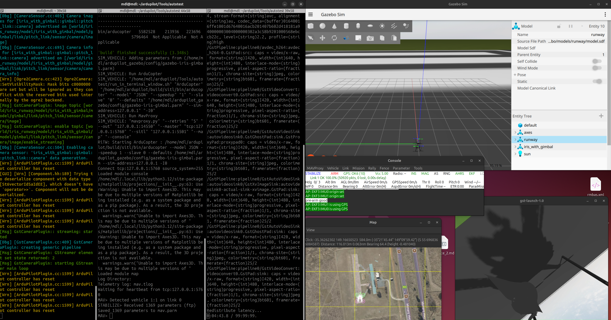

# Практическое задание №2

# Использование SITL Ardupilot в симуляторе Gazebo

## Требуемое программное обеспечение

В данном разделе указывается программное обеспечение, необходимое для выполнения данной практической работы. Однако, представленное здесь программное обеспечение будет использоваться и для выполнения других практических работ, поэтому крайне рекомендуется:

* знать, откуда скачать;
* уметь установить;
* владеть интерфейсом, основными функциями и документацией.

> Главный источник информации для достижения данных рекомендаций - изучение документации и использование сети Интернет. 😄 👍
>
> Использование LLM крайне не привествуется и будет наказываться. 😕 👎

### ROS 2 Jazzy

[Руковдство по установке](https://docs.ros.org/en/jazzy/Installation/Ubuntu-Install-Debs.html)

### Gazebo Harmonic

[Руковдство по установке](https://gazebosim.org/docs/harmonic/ros_installation/)

### Gazebo SITL Ardupilot

[Руководство по установке Ardupilot Gazebo](https://github.com/ArduPilot/ardupilot_gazebo/blob/main/README.md)

[Руковдство по запуску](https://ardupilot.org/dev/docs/sitl-with-gazebo.html)

[Использование Mission Planer в качестве GSC](https://ardupilot.org/dev/docs/using-sitl-for-ardupilot-testing.html#using-a-different-gcs-instead-of-mavproxy)

[Руководство по запуску Mission Planer в Ubuntu](https://ardupilot.org/planner/docs/mission-planner-installation.html#mission-planner-on-linux)

## Введение

Данная практическая работа направлена на получения практических навыков подготовки окружения к запуску и практическому применению SITL на примере симулятора Gazebo, автопилота Ardupilot и наземной станции управления Mission Planer.

## Выполнение практической работы

### Этап 1 - установка программного обеспечения

Аналогично прошлой, выполнение данной практическй работы осуществляется в операционной системе Ubuntu 24.04.

В первую очередь, осуществите установку ROS 2 Jazzy - [руководство по установке.](https://docs.ros.org/en/jazzy/Installation/Ubuntu-Install-Debs.html)

После успешной установки и выполнения тестовых скриптов раздела "Try some examples" руководства, перейдите к установке Gazebo Harmonic. Установка Gazebo Harmonic осуществляется одной командой:

```bash
sudo apt-get install ros-jazzy-ros-gz
```

Проверьте установку установку Gazebo Harmonic командой:

```bash
gz sim -v4 -r shapes.sdf
```

При успешном запуске тестового скрипта, переходим к установке Gazebo SITL для Ardupilot.

Осуществите установку Gazebo SITL для Ardupilot согласно [руководству по установке Ardupilot Gazebo](https://github.com/ArduPilot/ardupilot_gazebo/blob/main/README.md) разделы "Installation" и "Configure".

Клонируйте репозиторий Ardupilot:

```bash
git clone --recurse-submodules https://github.com/ArduPilot/ardupilot.git
```

Также установите зависимости, как показано в (руководстве)[Tools/environment_install/install-prereqs-ubuntu.sh -y]

Для удобного использования нескольких терминалов установите утилиту:

```bash
sudo apt install terminator
```
Также установите зависимости, необходимые для запуска видеопотока:

```bash
sudo apt install gstreamer1.0-libav gstreamer1.0-plugins-bad gstreamer1.0-plugins-ugly
```

### Этап 2 - Запуск Gazebo SITL Ardupilot

Откройте терминал через утилиту terminator комбинацией клавиш Ctrl+Alt+T.

Нажмите ПКМ по окну терминала и выберете "Split Vertically" для открытия двух терминалов в одном окне. Данное действие необходимо повторить дважды для отрытия трёх терминалов.

Копировать и вставлять команды в терминал можно комбинацией клавиш на английской раскладке Ctrl+Shift+C и Ctrl+Shift+V соответственно.

#### В левом терминале введите команду запуска симулятора Gazebo:

```bash
gz sim -v4 -r iris_runway.sdf
```

#### В среднем терминале введите последовательность команд:

1) Переход в директорию со скриптом запуска SITL:

```bash
cd ardupilot/Tools/autotest/
```

2. Запуск скрипта SITL

```bash
python3 sim_vehicle.py -D -v ArduCopter -f JSON --add-param-file=$HOME/ardupilot_gazebo/config/gazebo-iris-gimbal.parm --console --map
```

Дождитесь окончания компиляции и открытия всех окон SITL Ardupilot.

#### В правом терминале введите последоательность команд для получения изображении с камеры на дроне:

```bash
gz topic -l | grep -i "streaming"
gz topic -t /world/iris_runway/model/iris_with_gimbal/model/gimbal/link/pitch_link/sensor/camera/image/enable_streaming -m gz.msgs.Boolean -p "data: 1"
gst-launch-1.0 -v udpsrc port=5600 caps='application/x-rtp, media=(string)video, clock-rate=(int)90000, encoding-name=(string)H264' ! rtph264depay ! avdec_h264 ! videoconvert ! autovideosink sync=false
```

Расположите используемые окна удобным оборазом, как показано на картинке:



Средний терминал используется для ввода команд в SITL Ardupilot.

Введите в средний терминал следующую последовательность команд:

1) Перевод дрона в режим Guided

```bash
mode guided
```

2) Арм дрона

```bash
arm throttle
```

3) Взлет дрона

```bash
takeoff 5
```

Обратите внимание, что взлет дрона должен быть осуществлен в течение 10 секунд после арма, иначе дрон в целях безопасноси автоматически задизармится .

Данный SITL скрипт запущен с возможность управления подвесом камеры через следующие каналы:


| Action | Channel | RC Low     | RC High    |
| ------ | ------- | ---------- | ---------- |
| Roll   | RC6     | Roll Left  | Roll Right |
| Pitch  | RC7     | Pitch Down | Pitch Up   |
| Yaw    | RC8     | Yaw Left   | Yaw Right  |

Введем для тестирования данную последовательность команд:

```bash
rc 6 1100
rc 7 1900
rc 8 1500
```

Картинка с камеры должна была измениться.

### Этап 3 - Подключение к SITL через Mission Planer

Руководство для запуска Mission Planer в операционной системе Ubuntu находится [по ссылке](https://ardupilot.org/planner/docs/mission-planner-installation.html#mission-planner-on-linux) в разделе "Mission Planner on Linux".

В команду запуска скрипита SITL добавьте агрумент `--no-mavproxy` для выключения mavproxy и включения возможности подключения через TCP.

```bash
python3 sim_vehicle.py -D -v ArduCopter -f JSON --add-param-file=$HOME/ardupilot_gazebo/config/gazebo-iris-gimbal.parm --console --map --no-mavproxy
```

После запуска данного скрипта, перейдите в Mission Planer, в правом верхнем углу выберете способ подключения TCP, нажмите "Connect" и подключитесь к ip `127.0.0.1` к порту `5760`.

Далее вы используете SITL в Mission Planer уже знакомым вам способом.

### Этап 4 - Практическое задание

#### Задание 1

Необходимо определить значения RC команд управления подвесом камеры для трех положений камеры:

1. Камера смотрит вперед, наклонена вертикально вниз;
2. Камера смотрит вперед по уровню горизонта;
3. Камера направлена назад и расположена под углом в 45 градусов к земле.

Предоставьте заполненную таблицу со следующими полями.


| Положение | rc 6 | rc 7 | rc 6 |
| ------------------ | ---- | ---- | ---- |
| 1.                 |      |      |      |
| 2.                 |      |      |      |
| 3.                 |      |      |      |

#### Задание 2

Необходимо вывести список MAVLink сообщений, получаемых GSC от дрона.

Предоставьте заполненную таблицу со следующими полями.


| Название MAVLink сообщения | Частота принятия |
| ------------------------------------------- | ------------------------------- |
|                                             |                                 |
|                                             |                                 |

Для выполнения данного задания используйте MAVLink Inspector, встроенный в Mission Planer

#### Задание 3

Необходимо запустить lua-скрипт возврата домой, написанный в рамках выполнения задания по курсу "АМБАС" и предоставить демонстрацию его работы в симуляторе Gazebo.

